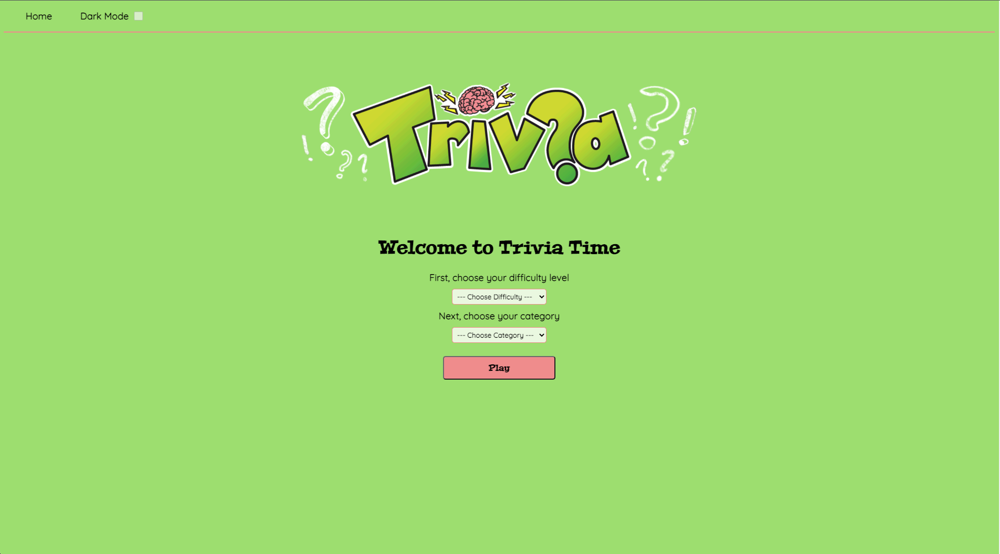

# TRIVIA TIME

## Description

A simple trivia application where the user can choose a difficulty level and a category. Trivia questions then start to display with multiple choice answers.

## Project Proposal (wireframes, user stories, API link, MVP, etc.)

See [Wiki](https://github.com/time2fishman/triva-time/wiki/Project-Proposal).

## Getting Started

### Dependencies

* Describe any prerequisites, libraries, OS version, etc., needed before installing program
* ex. Windows 10
* The app requires all of the basic libraries that are installed when use the `npx create-react-app app-name` comand. I have also installed a few extra packages
  * `npm install react-router-dom@6`

### Installing/Executing program

* After cloning the repo into your desired local directory, run the command `cd trivia-time` to change into the new directory
* Then run the command `npm start` to spin up the a local server
  * `ctrl + c` will stop the server when you aren't using it.
  
### Tech Stack
* HTML
* React
* CSS
* JavaScript

## Author

Adam Martinez 

## Version History

* 1.0.0
    * Initial product release

## License

## Acknowledgments

Thank you to my amazing fellow students at General Assembly and to my instructors (Alex, Jay, Matt, Shay).

Inspiration, code snippets, etc.
* [awesome-readme](https://github.com/matiassingers/awesome-readme)
* [PurpleBooth](https://gist.github.com/PurpleBooth/109311bb0361f32d87a2)
* [dbader](https://github.com/dbader/readme-template)
* [zenorocha](https://gist.github.com/zenorocha/4526327)
* [fvcproductions](https://gist.github.com/fvcproductions/1bfc2d4aecb01a834b46)
